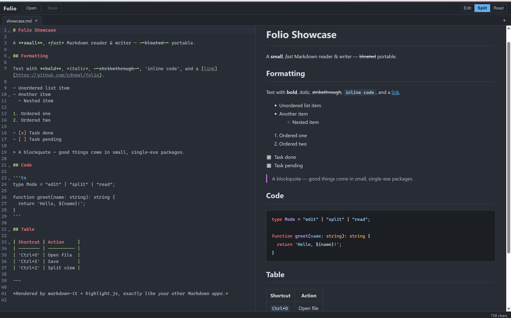
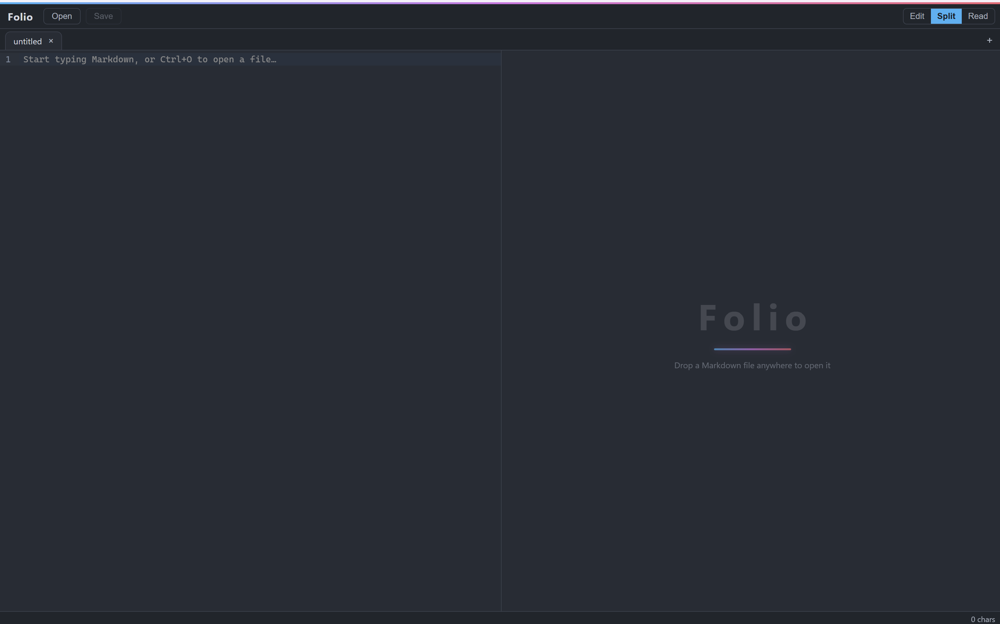

# Folio

[English](README.md) | **简体中文**

一个轻巧的 Windows Markdown 阅读/编辑器,基于 Tauri 2 构建。
单个便携 `.exe`(约 11 MB)—— 无安装器、无运行时依赖、无遥测。

<p align="center">
  
  
</p>

## 功能

- **三种视图模式** —— 编辑、分栏(实时预览)、阅读
- **多标签页** —— 未保存关闭确认、中键关闭、溢出箭头 + 滚轮滚动
- **拖放** —— 支持多文件拖入,打开对话框支持多选
- **忠实渲染** —— markdown-it(`breaks: true`)+ highlight.js + 任务列表,渲染效果与主流 Markdown 软件一致
- **舒适编辑** —— CodeMirror 6 + One Dark 主题
- **极薄 Rust 层** —— 零自定义 Tauri 命令,文件访问只走官方 `dialog` + `fs` 插件

## 快捷键

| 快捷键 | 功能 |
|---|---|
| `Ctrl+O` | 打开文件(可多选) |
| `Ctrl+S` | 保存 |
| `Ctrl+T` | 新建标签页 |
| `Ctrl+W` | 关闭标签页 |
| `Ctrl+1` / `Ctrl+2` / `Ctrl+3` | 编辑 / 分栏 / 阅读模式 |

## 技术栈

Tauri 2 · React 19 · TypeScript · Vite · CodeMirror 6 · markdown-it · highlight.js

## 开发

前置要求:Node.js、Rust(Windows 上为 MSVC 工具链)、WebView2 运行时。

```bash
npm install
npm run tauri dev      # 开发模式
npm test               # Vitest 单元测试
npm run tauri build    # 发布构建 → target/release/folio.exe
```

图标为程序化生成,见 `assets/gen-icon.mjs`(零依赖,渲染出 `assets/icon-source.png`;
用 `npx tauri icon assets/icon-source.png` 重新生成全套图标)。

## 许可证

[Apache-2.0](LICENSE) © 2026 Xun
